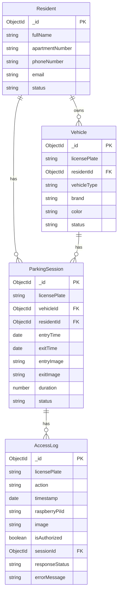

# Car Parking Management System (NestJS Backend)

Hệ thống backend quản lý bãi đỗ xe thông minh, được xây dựng bằng **NestJS**, tích hợp **MongoDB** và **MQTT** để xử lý dữ liệu thời gian thực từ các thiết bị IoT (Raspberry Pi).

## 🚀 Tính năng chính

- **Quản lý Cư dân & Xe**: API CRUD đầy đủ để quản lý thông tin cư dân và phương tiện đăng ký.
- **Kiểm soát Ra/Vào**:
  - Nhận tín hiệu quét biển số từ MQTT (`parking/scan`).
  - Tự động kiểm tra xe đăng ký, tạo phiên đỗ xe (Parking Session).
  - Tính toán thời gian đỗ xe khi xe ra.
- **Realtime Dashboard**:
  - Sử dụng **WebSocket (Socket.IO)** để đẩy dữ liệu trực tiếp lên Dashboard.
  - Cập nhật số lượng xe trong bãi, lượt ra vào trong ngày.
  - Cảnh báo xe lạ hoặc truy cập trái phép ngay lập tức.
- **Lịch sử & Báo cáo**: Lưu trữ chi tiết lịch sử ra vào và log truy cập hệ thống.

## � Database Schema (ER Diagram)



## �🛠 Công nghệ sử dụng

- **Framework**: [NestJS](https://nestjs.com/) (Node.js)
- **Database**: MongoDB (Mongoose)
- **Messaging**: MQTT (HiveMQ / Mosquitto)
- **Realtime**: Socket.IO
- **Language**: TypeScript

## 📦 Cài đặt & Chạy dự án

### 1. Yêu cầu

- Node.js (v16+)
- MongoDB (Local hoặc Atlas)

### 2. Cài đặt dependencies

```bash
npm install
```

### 3. Cấu hình môi trường

Tạo file `.env` tại thư mục gốc và điền thông tin:

```env
MONGO_URI=mongodb+srv://<user>:<pass>@<cluster>.mongodb.net/car_parking
MQTT_BROKER_URL=mqtt://broker.hivemq.com
```

### 4. Khởi tạo dữ liệu mẫu (Seeding)

Chạy lệnh sau để tạo dữ liệu cư dân và xe mẫu:

```bash
npx ts-node src/seed.ts
```

### 5. Chạy Server

```bash
# Chế độ development
npm run start:dev

# Chế độ production
npm run start:prod
```

Server sẽ chạy tại: `http://localhost:3000`

## 🔌 API Documentation

### REST API

| Method        | Endpoint             | Mô tả                 |
| :------------ | :------------------- | :-------------------- |
| **Residents** |                      |                       |
| `GET`         | `/residents`         | Lấy danh sách cư dân  |
| `POST`        | `/residents`         | Thêm cư dân mới       |
| **Vehicles**  |                      |                       |
| `GET`         | `/vehicles`          | Lấy danh sách xe      |
| `POST`        | `/vehicles`          | Đăng ký xe mới        |
| **Parking**   |                      |                       |
| `GET`         | `/parking-sessions`  | Lịch sử ra vào        |
| `GET`         | `/access-logs`       | Log truy cập chi tiết |
| **Dashboard** |                      |                       |
| `GET`         | `/dashboard/summary` | Thống kê tổng quan    |

### WebSocket Events

Kết nối tới `http://localhost:3000` (sử dụng Socket.IO Client).

| Event Name          | Direction        | Mô tả                                         |
| :------------------ | :--------------- | :-------------------------------------------- |
| `parking/live-feed` | Server -> Client | Thông tin xe vừa vào/ra (kèm ảnh, tên cư dân) |
| `dashboard/stats`   | Server -> Client | Cập nhật số lượng xe trong bãi                |
| `parking/alert`     | Server -> Client | Cảnh báo xe lạ / lỗi hệ thống                 |

## 📡 MQTT Integration (IoT Devices)

Hệ thống lắng nghe dữ liệu từ các thiết bị IoT (Raspberry Pi / Camera AI) qua giao thức MQTT.

### Topic

Topic nhận tín hiệu từ thiết bị IoT:
`parking/scan`
Topic gửi tín hiệu ra thiết bị IoT:
`parking/response`

### Payload Format (JSON)

Thiết bị cần gửi dữ liệu tại topic `parking/scan` theo định dạng sau:

```json
{
  "licensePlate": "81AX-032692",
  "cardId": "6F8CC2FB",
  "timestamp": "2025-11-22T08:00:00.000Z",
  "action": "entry",
  "image": "http://example.com/image.jpg",
  "raspberryPiId": "pi-01"
}
```

Thiết bị cần nhận tín hiệu từ topic `parking/response` theo định dạng sau:

```json
{
  "pattern": "parking/response",
  "data": {
    "status": "warning",
    "message": "Xe chưa vào bãi, không thể ra",
    "allowAccess": false
  }
}
```

```json
{
  "pattern": "parking/response",
  "data": {
    "status": "success",
    "message": "Chào mừng Nguyen Van Muoi - B1404",
    "allowAccess": true,
    "entryTime": "2025-12-19T21:58:00.000Z"
  }
}
```

```json
{
  "pattern": "parking/response",
  "data": {
    "status": "warning",
    "message": "Xe đang trong bãi, không thể vào lại",
    "allowAccess": false
  }
}
```

```json
{
  "pattern": "parking/response",
  "data": {
    "status": "success",
    "message": "Tạm biệt Nguyen Van Muoi",
    "allowAccess": true,
    "exitTime": "2025-12-19T22:34:00.000Z",
    "duration": 36
  }
}
```

| Field           | Type     | Description                          |
| :-------------- | :------- | :----------------------------------- |
| `licensePlate`  | String   | Biển số xe nhận diện được            |
| `timestamp`     | ISO Date | Thời gian quét                       |
| `action`        | String   | `entry` (xe vào) hoặc `exit` (xe ra) |
| `image`         | String   | URL hoặc Base64 của ảnh chụp         |
| `raspberryPiId` | String   | ID của thiết bị gửi dữ liệu          |

## 🧪 Testing

### Test MQTT (Giả lập Camera gửi dữ liệu)

Mở terminal mới và chạy:

```bash
node legacy_code/test_mqtt.js
```

Script này sẽ gửi giả lập tín hiệu xe vào và xe ra tới server.

### Test WebSocket

Sử dụng **Postman** (chế độ Socket.IO) hoặc chạy script test client:

```bash
node test_ws_client.js
```

## 📂 Cấu trúc dự án

```text
src/
├── access-logs/       # Module quản lý log truy cập
├── dashboard/         # Module thống kê dashboard
├── events/            # WebSocket Gateway
├── parking/           # Logic xử lý ra vào & MQTT
├── parking-sessions/  # Module quản lý phiên đỗ xe
├── residents/         # Module quản lý cư dân
├── schemas/           # Mongoose Schemas (DB Models)
├── vehicles/          # Module quản lý xe
├── app.module.ts      # Main Module
└── main.ts            # Entry point
```
