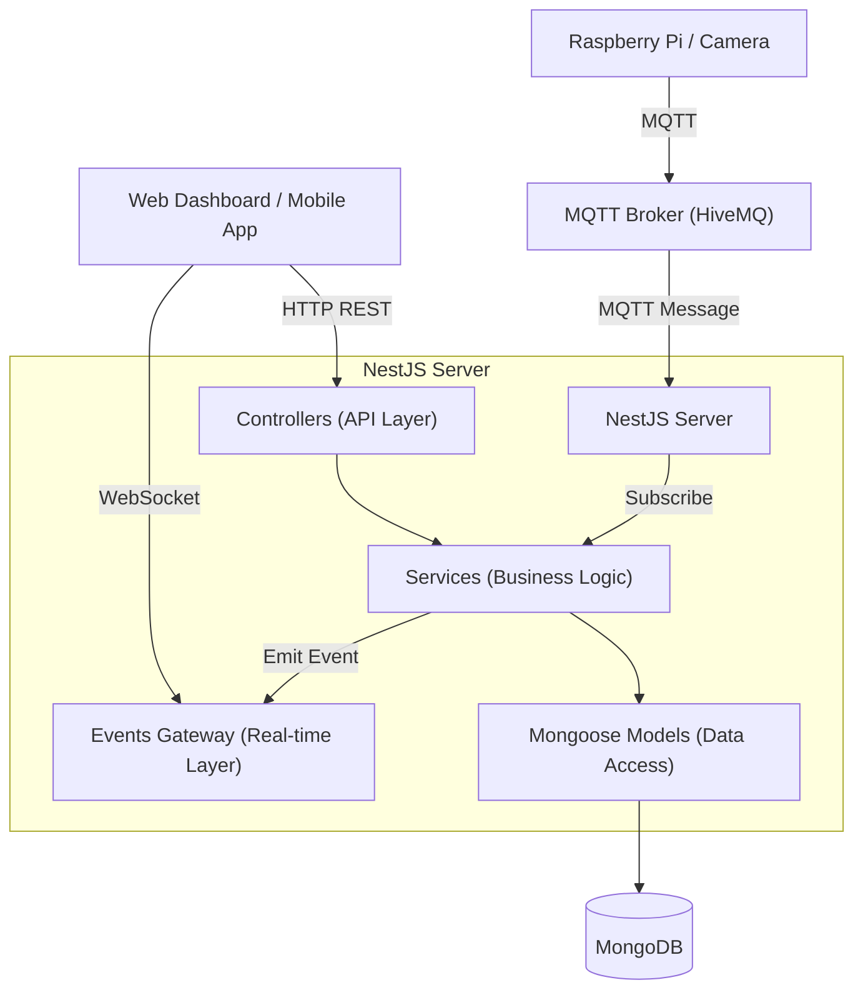
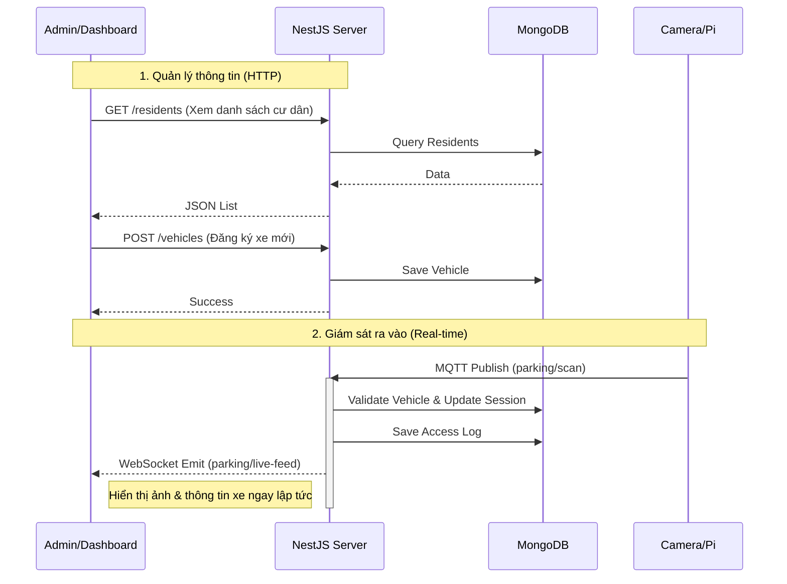

# Tài Liệu Thiết Kế Kỹ Thuật - Hệ Thống Quản Lý Bãi Đỗ Xe

## 1. Lý do chọn giải pháp (Solution Rationale)

Hệ thống được xây dựng dựa trên các công nghệ hiện đại nhằm đảm bảo tính **thời gian thực (real-time)**, **khả năng mở rộng (scalability)** và **độ tin cậy (reliability)**.

*   **NestJS (Backend Framework)**:
    *   **Kiến trúc Modular**: Giúp tổ chức code rõ ràng, dễ bảo trì và mở rộng (chia thành các module: Parking, Residents, Vehicles...).
    *   **TypeScript**: Cung cấp static typing, giảm thiểu lỗi runtime và hỗ trợ tốt cho việc phát triển dự án lớn.
    *   **Hỗ trợ Microservices & Hybrid App**: NestJS hỗ trợ tích hợp sẵn MQTT và WebSocket, cho phép xử lý đồng thời HTTP request và IoT messages trong cùng một ứng dụng.

*   **MongoDB (Database)**:
    *   **Linh hoạt (Schema-less)**: Phù hợp để lưu trữ dữ liệu log (AccessLog) và các phiên đỗ xe (ParkingSession) có thể thay đổi cấu trúc hoặc mở rộng trường dữ liệu trong tương lai mà không ảnh hưởng nhiều đến hệ thống.
    *   **Hiệu năng cao**: Tốc độ ghi (write) tốt, phù hợp cho việc ghi log liên tục từ các thiết bị IoT.

*   **MQTT (IoT Communication)**:
    *   **Lightweight**: Giao thức nhẹ, tối ưu cho băng thông thấp và đường truyền không ổn định, rất phù hợp cho các thiết bị nhúng như Raspberry Pi gửi dữ liệu về server.
    *   **Pub/Sub Model**: Giúp tách biệt giữa thiết bị gửi (Publisher) và server xử lý (Subscriber), đảm bảo tính bất đồng bộ.

*   **Socket.IO (Real-time Updates)**:
    *   Cung cấp kênh giao tiếp hai chiều thời gian thực giữa Server và Web Dashboard.
    *   Giúp cập nhật trạng thái bãi xe, hình ảnh ra vào và cảnh báo ngay lập tức mà không cần người dùng phải tải lại trang (F5).

## 2. Sơ đồ phần mềm (Software Architecture)

Hệ thống tuân theo kiến trúc **Layered Architecture** trong NestJS:



*   **Controller**: Xử lý các yêu cầu HTTP từ người dùng (quản lý cư dân, xe, xem báo cáo).
*   **Service**: Chứa logic nghiệp vụ chính (xử lý xe vào/ra, tính phí, kiểm tra điều kiện).
*   **Gateway**: Quản lý kết nối WebSocket, đẩy dữ liệu xuống Client.
*   **Model**: Tương tác trực tiếp với cơ sở dữ liệu MongoDB.

## 3. Giải thuật xử lý ra vào (Parking Algorithm)

Logic chính nằm trong `ParkingService.handleScan`, xử lý tín hiệu từ MQTT topic `parking/scan`.

### Quy trình xử lý:

1.  **Nhận dữ liệu**: Server nhận payload JSON `{ licensePlate, action, ... }`.
2.  **Xác thực xe (Validation)**:
    *   Tìm kiếm biển số trong CSDL (`VehicleModel`).
    *   Nếu **không tìm thấy** hoặc xe **không hoạt động** (`status != active`):
        *   Ghi log truy cập trái phép (`isAuthorized: false`).
        *   Gửi cảnh báo `parking/alert` qua WebSocket.
        *   **Từ chối truy cập**.
3.  **Xử lý theo hành động (`action`)**:
    *   **Trường hợp `entry` (Xe vào)**:
        *   Kiểm tra xem xe có đang trong bãi không (tìm `ParkingSession` có `status: 'in_parking'`).
        *   Nếu **đã có trong bãi**: Cảnh báo (tránh lỗi logic).
        *   Nếu **chưa có**:
            *   Tạo phiên đỗ xe mới (`ParkingSession`).
            *   Ghi log vào (`AccessLog`).
            *   Gửi sự kiện `parking/live-feed` (kèm thông tin cư dân, ảnh) xuống Dashboard.
            *   Cập nhật thống kê số lượng xe.
    *   **Trường hợp `exit` (Xe ra)**:
        *   Tìm phiên đỗ xe đang hoạt động của xe này.
        *   Nếu **không tìm thấy**: Cảnh báo (xe chưa vào mà đòi ra).
        *   Nếu **tìm thấy**:
            *   Tính thời gian đỗ: `Duration = ExitTime - EntryTime`.
            *   Cập nhật phiên đỗ xe: Gán `exitTime`, `duration`, chuyển trạng thái thành `completed`.
            *   Ghi log ra.
            *   Gửi sự kiện `parking/live-feed` (kèm thời gian đỗ) xuống Dashboard.
            *   Cập nhật thống kê.

## 4. Lược đồ tương tác người dùng (User Interaction Flow)

Mô tả luồng tương tác giữa Người dùng (Admin/Bảo vệ) và Hệ thống.



## 5. Giao thức giao tiếp (Communication Protocols)

Hệ thống sử dụng 3 giao thức chính:

### A. MQTT (Message Queuing Telemetry Transport)
*   **Mục đích**: Truyền tải dữ liệu từ thiết bị IoT về Server.
*   **Broker**: HiveMQ (public) hoặc Mosquitto (local).
*   **Topic**: `parking/scan`
*   **Payload Format**:
    ```json
    {
      "licensePlate": "30A-12345",
      "timestamp": "2023-11-22T08:00:00.000Z",
      "action": "entry",
      "image": "base64_string_or_url",
      "raspberryPiId": "pi-01"
    }
    ```

### B. WebSocket (Socket.IO)
*   **Mục đích**: Cập nhật giao diện Dashboard thời gian thực.
*   **Events**:
    *   `parking/live-feed`: Gửi thông tin xe vừa vào/ra (Server -> Client).
    *   `dashboard/stats`: Gửi số lượng xe đang trong bãi (Server -> Client).
    *   `parking/alert`: Gửi cảnh báo an ninh (Server -> Client).

### C. HTTP (RESTful API)
*   **Mục đích**: Quản lý dữ liệu (CRUD) và lấy báo cáo.
*   **Định dạng**: JSON.
*   **Các Endpoints chính**:
    *   `GET /residents`: Danh sách cư dân.
    *   `POST /vehicles`: Đăng ký xe.
    *   `GET /parking-sessions`: Lịch sử đỗ xe.
    *   `GET /access-logs`: Nhật ký truy cập hệ thống.
